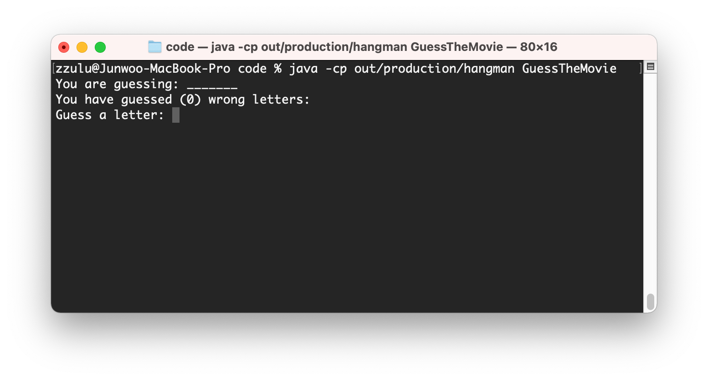
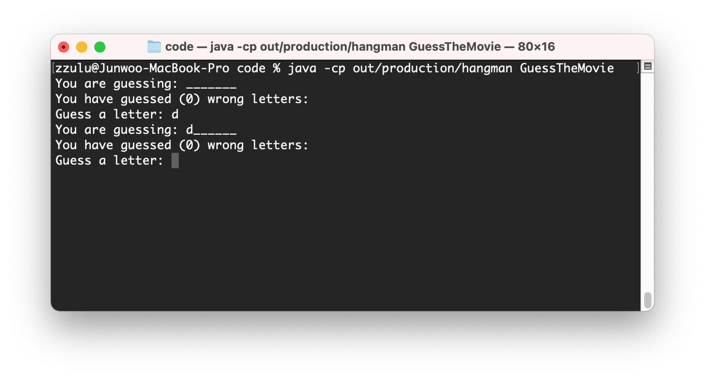
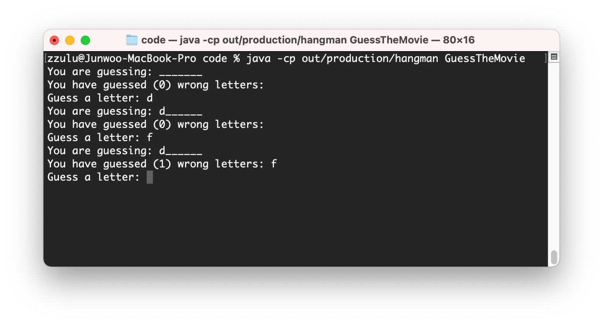
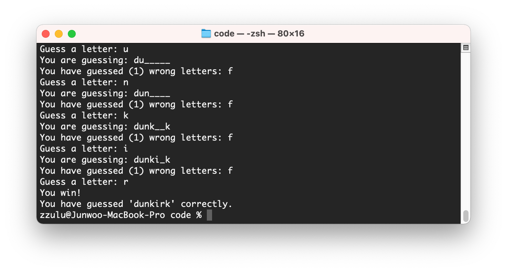

# Hangman
Hangman with movie data


## 1. `hangman` 소개

- [게임 설명](https://namu.wiki/w/%ED%96%89%EB%A7%A8)
- [플레이 해보기](https://www.gamestolearnenglish.com/hangman/)


## 2. 요구사항

### (1) 게임 화면

아래와 같은 게임 화면을 구성한다.

* `GuessTheMovie.java` 파일을 컴파일 후 실행하면, 다음과 같은 화면이 출력된다.



### (2) 게임 내용

### [필수] 1단계: 단어 추측 기능 구현 

1. `movies.txt` 파일에 저장된 하나의 영화 제목을 무작위로 선택한다.

```
the suicide squad
rocky
the shawshank redemption
the godfather
the dark knight
...
```

2. 사용자가 알파벳을 입력하면, 해당 알파벳이 단어에 포함되어 있는지를 판별하고 알파벳이 들어 있을 경우 해당하는 모든 알파벳을 표시한다.



3. 만약 사용자가 입력한 알파벳이 단어에 포함되어 있지 않은 경우, 아래와 같이 틀린 알파벳이 무엇인지 출력한다.



4. 사용자가 단어를 맞출 때까지 게임은 계속되며, 단어를 맞출 경우 게임이 종료된다.




### [필수] 2단계: 에러 핸들링 및 추가 요구사항 구현

1. 알파벳 입력 기회 제한 (기본 15회)

2. 입력값 에러 핸들링
    - 입력 값이 없을 경우
    - 같은 값을 입력 했을 경우
    - 유효하지 않은 값(알파벳 제외)을 입력 했을 경우

### [선택] 3단계: 추가 영화 리스트 활용

- `movies.txt` 파일 대신 아래의 영화 리스트 중 하나를 선택, 스크랩 또는 응답 받은 데이터를 활용하여 그 중 하나를 임의로 선택하는 로직 구현
  - 로튼토마토 Top 100 영화 리스트(https://www.rottentomatoes.com/top/bestofrt/)
  - 영화진흥위원회(http://www.kobis.or.kr/kobisopenapi)
  - The Movie Database(https://developers.themoviedb.org/3)


## 3. 제출

- Git을 통해 본 GitHub repository를 clone, 프로젝트 폴더로 이동

    ```bash
    $ git clone https://github.com/coupang-edu/c4e-java-project-01
    $ cd c4e-java-project-01
    ```

- 본인의 영문명으로 branch 생성 및 이동

    ```bash
    $ git switch -c john
    ```

- 작성 완료된 코드는 아래 예시와 같이 본인의 영문명으로 폴더를 생성하여 저장 (폴더 구조는 자유롭게 구성)

    ```
    README.md
    john/
        └── src/
            └── com.coupang.c4e/
                └── hangman/
                    ├── ...
                    └── GuessTheMovie.java
    ```

- 커밋 완료 후, 해당 branch를 push

    ```bash
    $ git push origin john
    ```

- Pull Request 생성하여 제출 완료
